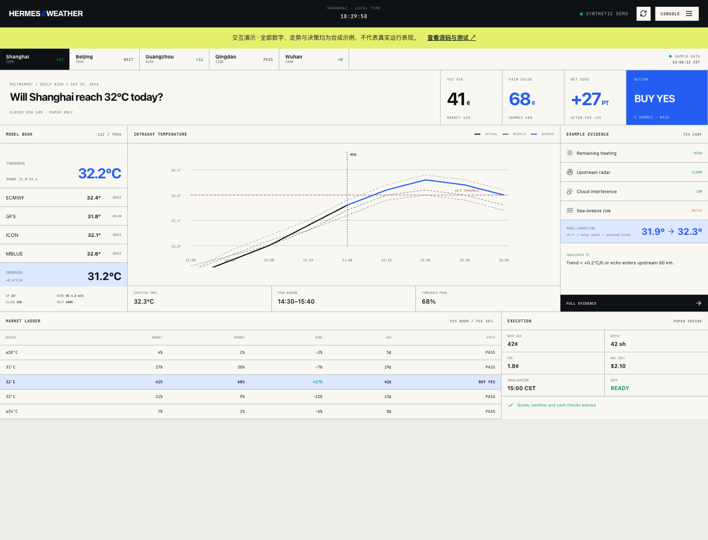
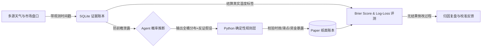

# Hermes Weather · AI 天气研究与决策审计

> **“让 AI 负责概率推理，让确定性代码守住执行底线。”**  
> 面向 Polymarket 天气预测市场的多源证据采集、LLM Agent 决策推断、确定性风控与自动化结算评测系统。

[🚀 在线交互演示](https://libuyi543-lang.github.io/weather-no-strategy/) · [⚡ 快速开始](docs/quickstart.md) · [📐 架构设计与代码地图](docs/architecture.md) · [📊 评测与可核验指标](docs/verification.md) · [English README](README.en.md)

[](https://github.com/libuyi543-lang/weather-no-strategy/actions/workflows/ci.yml)
[](docs/verification.md)
[](LICENSE)
[](docs/quickstart.md)
[](docs/architecture.md)



> ⚠️ **研究与系统声明**：本项目为**量化与 Agent 系统工程开源研究原型**，仅支持 **Paper Trading（纸面模拟）**，不包含也不提供任何实盘交易功能。在线演示界面采用合成测试数据展示；不承诺实时行情、真实收益率或未来预测优势。

---

## 💡 为什么做这个项目（核心问题）

在预测市场中，让大语言模型单纯输出一个预测是廉价的。更难的问题是：
- **证据断代**：模型决策时，看到的是什么时刻的数据？有没有发生未来信息穿越？
- **置信度边界**：模型给出的理由听起来很合理，但在深度薄弱、滑点剧烈的盘口下真的有正向 Expectation（Edge）吗？
- **权限与越权控制**：AI 是否可以直接决定成交？还是必须有一层无条件拦截不合格交易的确定性风控？

本项目将全链路解耦为 **证据采集 ➔ Agent 概率推断 ➔ 确定性安全拦截 ➔ 真实结算复盘** 四个环节，构建一套**透明、可证伪、有边界**的决策闭环：



---

## 🛠️ 架构与可核验模块

| 核心层级 | 业务职责与技术细节 | 可核验核心代码 |
| :--- | :--- | :--- |
| **01 多源证据账本** | 异步采集机场 METAR/SPECI、ECMWF 集合预报、Windy 曲线及 Polymarket 前五档订单簿；统一写入 SQLite (WAL) 并时区对齐，严格防止数据泄露。 | [`weather_market_monitor.py`](weather_market_monitor.py)<br>[`weather_data_store.py`](weather_data_store.py) |
| **02 Agent 概率推断** | 输出完整可交易温度档概率（Sum=1）、置信度、核心天气驱动事实与反证失效条件。 | [`weather_edge_agent.py`](weather_edge_agent.py)<br>[`weather_edge_agent.schema.json`](weather_edge_agent.schema.json) |
| **03 确定性执行门控** | 规则层接管：实施向市场先验收缩（Shrinkage）、滑点估算、Fractional Kelly 仓位控制与单城资金上限；不达标一律 `WAIT`。 | [`weather_edge_agent.py`](weather_edge_agent.py)<br>[`test_weather_edge_agent.py`](test_weather_edge_agent.py) |
| **04 结算评测与复盘** | 结算后自动物化真实温度，利用 Brier Score 与 Log-Loss 评测 AI 相较于市场基线的校准度，触发独立 Agent 归因复盘。 | [`weather_forecast_evaluator.py`](weather_forecast_evaluator.py)<br>[`weather_edge_feedback.schema.json`](weather_edge_feedback.schema.json) |

> 覆盖城市：当前 Edge 配置专项覆盖上海、北京、广州、青岛、武汉、重庆、成都 7 大核心城市。

---

## ⚡ 3 分钟本地跑通（快速验证）

本项目提供完备的 Mock 数据与测试，**无需 API Key 或外部数据库即可完整运行测试集**：

```bash
# 1. 克隆仓库
git clone https://github.com/libuyi543-lang/weather-no-strategy.git
cd weather-no-strategy

# 2. 虚拟环境与依赖
python3 -m venv .venv
source .venv/bin/activate
pip install -r requirements-dev.txt

# 3. 运行本地自动化测试（当前 270 项测试全部通过）
python3 -m unittest discover -v
```

如果你想在本地体验 Web 可视化面板：

```bash
cd hermes_gui
npm ci
npm run dev
# 浏览器打开 http://localhost:5173
```

---

## 🔬 工程规范与严谨性声明

1. **测试驱动**：全仓库包含 **270 项单元测试**，严密覆盖了边界溢出、数据过期、格式畸形、重复温度桶、单日资金越界等极端场景。
2. **拒绝盲目自嗨**：绝不在 README 中捏造未经验证的“年化胜率”或“暴利指标”。该项目展示的是一套**对 AI 概率进行严谨审计与边界控制的方法论**。
3. **开源资产边界**：敏感 API Token、私有数据库账本已严格脱敏。系统结构与算法逻辑完全透明开源。

---

## 📉 研究结论（含负结果）

截至 2026-09-24，对中国 7 城最高温市场的 edge 排查**没有找到可稳定变现的 edge**：多桶结构 MIXE10 样本外失效；气象模型全面输给市场；taker 全档负 EV；做市被逆向选择显著吃亏；市场在 AWC 发布 METAR 前已完成约 95% 定价；唯一候选信号（青岛海风）样本外未确认。完整数字、脚本与报告索引见 [docs/research_findings.md](docs/research_findings.md)，研究脚本在 [`research/`](research/)，报告在 [`research/output/`](research/output/)。

---

## 🤝 交流与贡献

- 如果你在探索 **AI Agent 边界控制**、**金融/预测市场量化研究** 或 **概率校准系统**，欢迎 Star 关注本项目。
- 欢迎提交 Issue 探讨极端天气与盘口错价场景：[提交 Issue / 案例反馈](https://github.com/libuyi543-lang/weather-no-strategy/issues/new/choose)
- 详细贡献指南请查阅 [CONTRIBUTING.md](CONTRIBUTING.md)。

## 📄 License

本项目代码遵循 [MIT License](LICENSE)。所引用的第三方气象或预测市场公开接口请遵守各平台服务协议。
