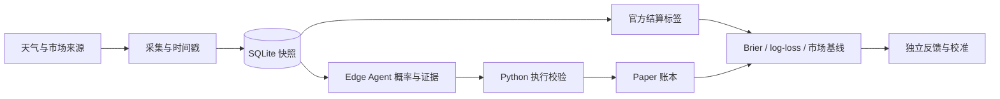

# 架构与代码地图

## 当前入口

`weather_edge_agent.py` 继承并复用 `weather_ai_agent.py` 中的基础能力。当前配置在 `weather_edge_agent_config.json`，核心协议在 `weather_edge_agent.schema.json`。AI 提供全桶概率与证据，Python 执行概率收缩、费用计算、确定性仓位控制及纸面成交检查。

`weather_market_monitor.py` 和 `weather_metar_fast_collector.py` 采集证据；`weather_data_store.py` 持久化；`weather_forecast_cutoff_tracker.py` 保存可用信息截点；`weather_forecast_evaluator.py` 与 Edge 的结算逻辑提供评测。

## 两种界面

- `hermes_gui/`：静态公开交互演示，全部数字为合成案例。不会调用模型或连接数据库。
- `weather_dashboard/`：读取本地 SQLite 的真实看板，需要先运行采集器。

## 历史与研究边界

`weather_dual_strategy.py`、单桶 NO、三桶 YES 及 `weather_outcome_reviewer.py` 属于历史策略链路；不能与当前 Edge 同时运行并把不同账本合并为同一成绩。`research/` 包含离线研究工具，`legacy/` 保留已退役实现。

`docs/operations-history.md` 保留发布前的长篇运行笔记，混有历史入口，仅供追溯。它不是当前快速开始文档。`docs/legacy-agent-rules.md` 同样只描述历史双策略架构。
