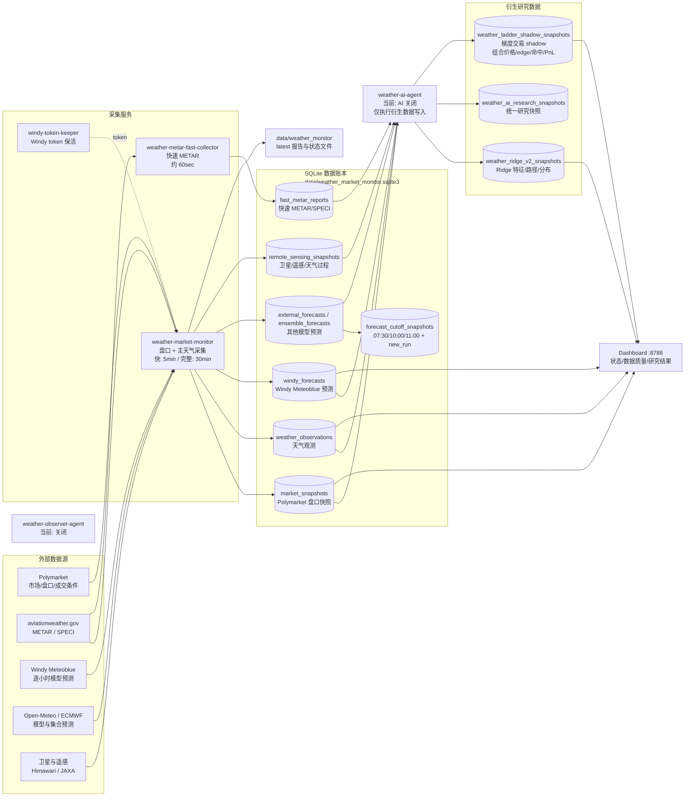

# Weather Market Data Collection Architecture

当前系统的目标是持续积累天气市场、天气观测、模型预测和梯度交易研究数据。AI 分析、Observer 分析和 Paper 交易目前关闭。

## 当前采集频率

| 数据 | 采集服务 | 当前频率 | 主要表 |
|---|---|---:|---|
| Polymarket 盘口 | `weather-market-monitor` | 快速 5 分钟，完整 30 分钟 | `market_snapshots` |
| METAR / SPECI | `weather-metar-fast-collector` | 约 60 秒 | `fast_metar_reports` |
| 主天气观测 | `weather-market-monitor` | 快速/完整周期 | `weather_observations` |
| Windy Meteoblue | `weather-market-monitor` | 完整周期约 30 分钟 | `windy_forecasts` |
| Open-Meteo / ECMWF | `weather-market-monitor` | 默认约 180 分钟 | `external_forecasts`, `ensemble_forecasts` |
| CMA-GFS / GRAPES Global | `weather-market-monitor` | 默认约 180 分钟 | `external_forecasts` |
| CMA-MESO 3 km | `weather-market-monitor` | 获得正式接口后每 30 分钟探测 | `external_forecasts` |
| 模型冻结截点 | `weather-market-monitor` | 每 5 分钟检查，固定 07:30/10:00/11:00 | `forecast_cutoff_snapshots` |
| 卫星/遥感 | `weather-market-monitor` | 随采集周期，部分源有单独间隔 | `remote_sensing_snapshots` |
| Ridge / 梯度 shadow | `weather-ai-agent` 数据模式 | 约 5 分钟研究快照 | `weather_ridge_v2_snapshots`, `weather_ladder_shadow_snapshots` |

## 现在运行与暂停的部分

- 运行：盘口、主天气、快速 METAR、Windy Meteoblue、模型预测、遥感、Ridge 和 ladder shadow 数据积累。
- 暂停：AI 决策、AI lesson、Observer AI、Paper 交易和日报。
- 看板只读取 SQLite 和 latest 状态文件，不参与数据采集。

## 数据流的核心关系

1. `market_snapshots` 是交易市场状态的原始时间序列。
2. `weather_observations`、`fast_metar_reports`、`windy_forecasts` 和模型预测描述真实天气与预测信息。
3. `weather_ridge_v2_snapshots` 将天气信息整理成可比较的路径/分布特征。
4. `weather_ladder_shadow_snapshots` 把相邻温度档组合成梯度交易候选，并记录价格、edge、命中和假设 PnL。
5. 研究和交易前应按 `event_id` / `target_date` 分组，不把同一市场内的快照当成独立样本。
